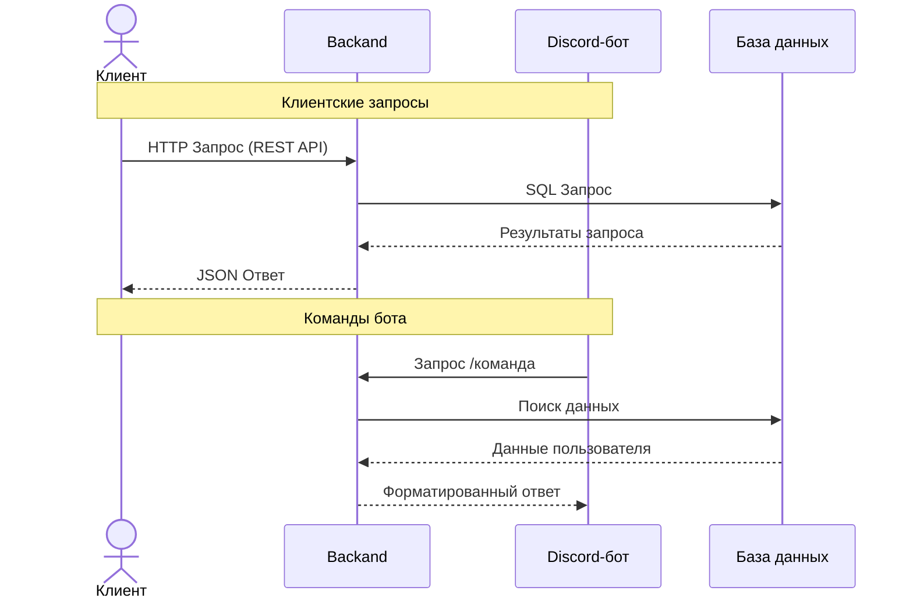

# 💻 Software Engineering Portfolio

[Вернуться к главному портфолио](../README.md)

## ⚙️ Discord Bot с микросервисной архитектурой

- хранение данных в PostgreSQL бд (отдельный Docker контейнер)
- авторизация через Discord
- отправка сообщения в канал Discord сервера по нажатию кнопки в клиенте

**Технологический стек**:

- Python 3.12 + FastAPI
- SQLAlchemy + PostgreSQL
- OAuth2 для авторизации через Discord
- Docker-контейнеризация

**Структура общения**

**GitHub**: [Исходный код](https://github.com/MarcT1me/GuardBotV2)
