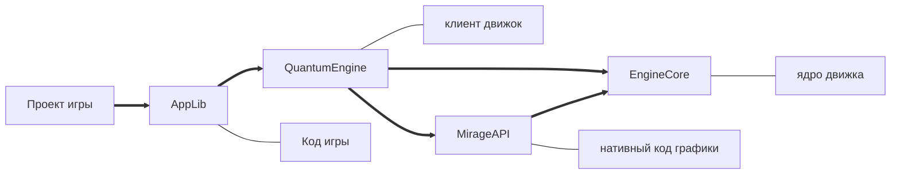

# 🎮 Game Development

[Вернуться к главному портфолио](../README.md)

## 🔧 Игровой движок (C++/C#)


- Загрузчик ресурсов (из файловой системы)
- _Мультиоконная_ архитектура
- Кастомная _система обработки ошибок_
- Близость кода игры к движку

**Текущие возможности**:

- Рендеринг _текстурных примитивов_
- Поддержка _ввода_ (мышь/клавиатура/геймпад)

**Структура**:



**GutHub**:
[исходный код](https://github.com/MarcT1me/CSQCv2) |
[установщик](https://github.com/MarcT1me/CSQCv2/releases/tag/0.15.5)

---

## 💫 Гравитационная симуляция (Java/LibGDX)


- Многопоточные физические расчеты большого кол-ва тел
- Динамическая визуализация траекторий
- Моделирование гравитации на основе реальных законов термодинамики

**GutHub**:
[исходный код](https://github.com/MarcT1me/GravitySimulation2-JavaEdition) |
[релиз](https://github.com/MarcT1me/GravitySimulation2-JavaEdition/releases/latest)

## Мини проекты на PyGame


### 🔫 ShooterGame

Простейшая игра - шутер

GitHub: [исходный код](https://github.com/MarcT1me/ShooterGameV2)

### 🏓 Pong game

Простая Pong game

```requirements
# requirements.txt
pygame
pyglm
```

#### управление

`W/S` - левая ракетка
`Up/Down` - правая ракетка

### ⭐ SpaceStars

Симуляция 3д через движение звёзд "в камеру"

```requirements
# requirements.txt
pygame
```

#### управление

J - "прыжок" (смена конфигурации симуляции с 1 на 2)

#### конфиги

`settings.json` - настройки окна, размеры, FPS и Alpha, влияющую на длину шлейфа от звезды
`params.json` - настройка симуляции, размеры звёзд, таблицы выбора цветов, количество звёзд и их зоны спавна
