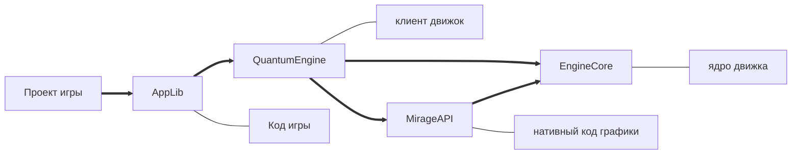

# 🎮 Game Development

[Вернуться к главному портфолио](../README.md)

## 🔧 Игровой движок (C++/C#)

- Загрузчик ресурсов (из файловой системы)
- _Мультиоконная_ архитектура
- Кастомная _система обработки ошибок_
- Близость кода игры к движку

**Текущие возможности**:

- Рендеринг _текстурных примитивов_
- Поддержка _ввода_ (мышь/клавиатура/геймпад)

**Структура**:

**GutHub**:
[исходный код](https://github.com/MarcT1me/CSQCv2) |
[установщик](https://github.com/MarcT1me/CSQCv2/releases/tag/0.15.5)

---

## Гравитационная симуляция (Java/LibGDX)

- Многопоточные физические расчеты большого кол-ва тел
- Динамическая визуализация траекторий
- Моделирование гравитации на основе реальных законов термодинамики

**GutHub**:
[исходный код](https://github.com/MarcT1me/GravitySimulation2-JavaEdition) |
[релиз](https://github.com/MarcT1me/GravitySimulation2-JavaEdition/releases/latest)

## Мини проекты на PyGame

